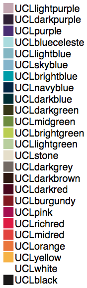

# UCL poster class for LaTeX

by Rob Stanley

A poster class for LaTeX that attempts to follow the [UCL Corporate Identity](http://www.ucl.ac.uk/corporate-identity).

Currently only compilation with XeLaTeX is supported.

## Installation and usage

Copy the `uclposter.sty` file to the directory containing the poster LaTeX file.
No additional files are needed (the banner/logo is included entirely as vector drawing code).

An example of how the class is used is given in the `example.tex` file.

## Optional class options
* `portrait` / `landscape` *(the orientation of the poster)*
* `bannerheight = ⟨length⟩` *(the height of the banner)*
* `logoheight = ⟨length⟩` *(the height of the UCL logo)*
* `margin = ⟨length⟩` *(the margin and column separation)*
* `color = ⟨colour⟩` *(the main banner colour)*
* `inverttitle` *(switches the banner font colour and the portico icon colour to black)*

## Additional information

* Multiple columns are supported by the `\multicol{⟨number⟩}` command from the [multicol](https://www.ctan.org/pkg/multicol) package.
* Authors and affiliations can be added with the `\author[⟨indices⟩]{⟨name⟩}` and `\affil[⟨index⟩]{⟨institution name⟩}` commands from the [authblk](https://www.ctan.org/pkg/authblk) package.
* A 'highlight box' environment can be generated with the `\begin{highlightbox}[⟨color⟩] ... \end{highlightbox}` commands.
* The [mathspec](https://www.ctan.org/tex-archive/macros/xetex/latex/mathspec) package is used to typeset in Helvetica, and so only compliation with XeLaTeX is currently supported.
* The [tikz](https://www.ctan.org/pkg/pgf) package is used to draw the header (converted from UCL supplied .eps files), and so no additional image files are required.

## Defined colours

The [UCL colour pallete](http://www.ucl.ac.uk/visual-identity/colour/updatedcolourswatch) has been defined as LaTeX colours for use in the banner and elsewhere.

## Notice

This package is unofficial and is not supported by UCL.
If there are any issues contact robert.stanley.10@ucl.ac.uk .
